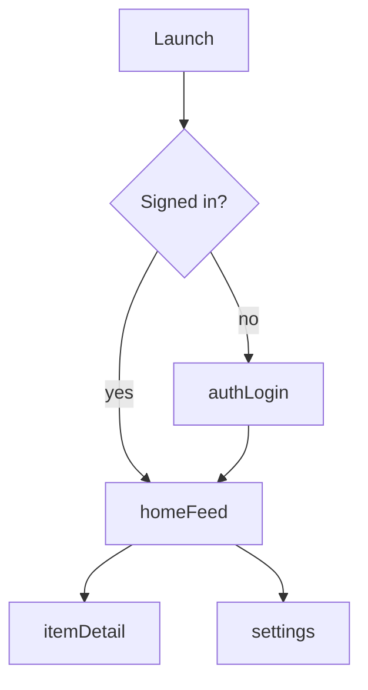

# Navigation Flow

Every `Route` case, what presents it, and how the user gets there.

- **Maintained by:** targeted edit on every route insertion or deletion.
  A full rescan is the `/sync-app-notes` **command** — it runs only when you type it.
- **Read this when:** adding a screen, wiring a deep link, or checking whether a flow is
  reachable.
- **Design rules:** [Navigation.md](../../docs/modules/Navigation.md). This file is the
  *inventory*; that file is the *rules*.

> Empty until `Packages/Navigation` and the first feature exist. `/sync-app-notes` populates it
> from the `Route` enum and the shell's `navigationDestination` switch.

---

## Route inventory

| Route case | Payload | Screen | Feature | Entry points | Deep link |
|---|---|---|---|---|---|
| — | — | — | — | — | — |

<!--
| `.authLogin` | — | LoginView | Auth | cold launch (signed out), sign-out | `app://auth/login` |
| `.itemDetail(id:)` | `Item.ID` | DetailView | Home | feed tap, push notification, Spotlight | `app://item/{id}` |
-->

`Entry points` matters more than it looks: a route with exactly one entry point is a candidate for
inlining; a route with none is dead code.

## Flow

<!-- Regenerate this diagram whenever a route is added or removed. Keep it to real edges only —
     an aspirational flow chart is worse than none. -->

## Container structure

| Size class | Container | Root selection |
|---|---|---|
| Compact (iPhone, Slide Over) | `NavigationStack(path:)` | — |
| Regular (iPad, Mac) | `NavigationSplitView` | sidebar `selectedRoot` |

Branching is on **size class only** — never device model, never width constants
([Navigation.md](../../docs/modules/Navigation.md)).

## Deep links

| URL pattern | Parses to | Requires auth | Fallback if unauthorized |
|---|---|---|---|
| — | — | — | — |

Parsing is pure and total; authorization is checked after, in the shell. An unparseable link lands
on a sensible root — never a blank screen, never a system alert.

## Scenes & windows

| Scene | Platform | Owns its own Router | Restoration |
|---|---|---|---|
| — | — | — | — |

Each scene owns its own `Router` — a shared one makes two windows fight over one path.

## Gaps

| Finding | Where | Noted |
|---|---|---|
| — | — | — |

`/sync-app-notes` flags: routes with no `navigationDestination` case, screens reachable only by
direct construction, deep links with no matching route, and any feature constructing another
feature's view (CLAUDE.md §2.1).
